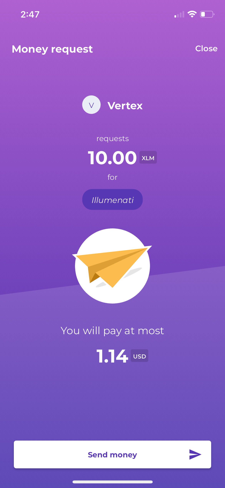

# Beans Merchant SDK React App

This repository contains a boilerplate React app designed for the Beans merchant SDK. It generates a QR code for payment requests in USDC or XLM on the Stellar network.


<br/>

# Getting started

```bash
yarn
yarn start
```

# Usage

Scan the QR code with the Beans app to make a payment request.



# Contributing

Please feel free to contribute to this project. The SDF welcomes contributors to assist in enhancing the interoperability of ecosystem tools with their respective parts in the Stellar stack.
